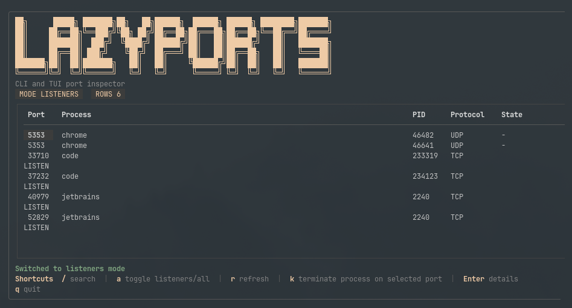

<p align="center">
  
</p>

**LazyPorts** is a terminal app for finding what is using your ports and stopping it quickly.

It gives you a fast TUI for browsing port bindings plus a focused CLI for listing and killing by port.



## Features

- TUI for browsing active port bindings
- Fuzzy search with `/`
- Safer termination: graceful stop first where supported, with explicit force-kill fallback
- Kill the selected process with `k`
- CLI commands for `list`, `kill`, and `version`
- Cross-platform support for Linux, macOS, and Windows

## Install

Install the latest release on Linux or macOS:

```bash
curl -fsSL https://raw.githubusercontent.com/DriesVanHool/lazyports/main/install.sh | bash
```

Install a specific release:

```bash
LAZYPORTS_VERSION=v0.1.0 curl -fsSL https://raw.githubusercontent.com/DriesVanHool/lazyports/main/install.sh | bash
```

If `~/.local/bin` is not on your `PATH`, add it after install.

Prefer to inspect the installer first:

```bash
curl -fsSL https://raw.githubusercontent.com/DriesVanHool/lazyports/main/install.sh -o install.sh
less install.sh
bash install.sh
```

Install to a custom directory:

```bash
LAZYPORTS_INSTALL_DIR="$HOME/.local/bin" curl -fsSL https://raw.githubusercontent.com/DriesVanHool/lazyports/main/install.sh | bash
```

## Quick Start

```bash
lazyports
lazyports list
lazyports list --all
lazyports kill 8080
lazyports kill 8080 --graceful-only
lazyports kill 8080 --force
lazyports version
```

## Usage

Launch the TUI:

```bash
lazyports
```

List active port bindings:

```bash
lazyports list
```

List listeners and active connections:

```bash
lazyports list --all
```

Terminate every listening process bound to a port. By default, LazyPorts tries a graceful stop first and force kills only if needed:

```bash
lazyports kill 8080
```

Only attempt graceful termination:

```bash
lazyports kill 8080 --graceful-only
```

Force kill immediately:

```bash
lazyports kill 8080 --force
```

Run from source:

```bash
go run .
go run . list
go run . list --all
go run . kill 8080
go run . kill 8080 --graceful-only
go run . kill 8080 --force
go run . version
```

Install with Go:

```bash
go install github.com/DriesVanHool/lazyports@latest
```

## TUI Keys

- `/` start fuzzy search
- `a` toggle between listeners and all connections
- `r` refresh the port list
- `k` terminate the selected process (graceful first, explicit force-kill fallback)
- `Enter` show details for the selected row
- `q` quit

## Platform Notes

- Linux: uses `lsof`, with `ss` as a fallback
- macOS: uses `lsof`
- Windows: uses `netstat` and `tasklist`

Some port listings and kill actions may require elevated privileges depending on the target process and OS.

## Privacy And Safety

- No telemetry
- No analytics
- No background network activity in the app itself
- Port inspection happens locally on your machine using OS tools like `lsof`, `ss`, `netstat`, and `tasklist`
- The installer only downloads release assets and `checksums.txt` from GitHub over HTTPS
- The installer verifies the downloaded archive checksum before installing
- Killing a process requires an explicit user action, and the TUI asks for confirmation

## Build

```bash
go build ./...
make cross-build
make package-release VERSION=v0.1.0
```

## Release Artifacts

Each tagged release publishes:

- `lazyports-linux-amd64.tar.gz`
- `lazyports-darwin-amd64.tar.gz`
- `lazyports-darwin-arm64.tar.gz`
- `lazyports-windows-amd64.zip`
- `checksums.txt`
